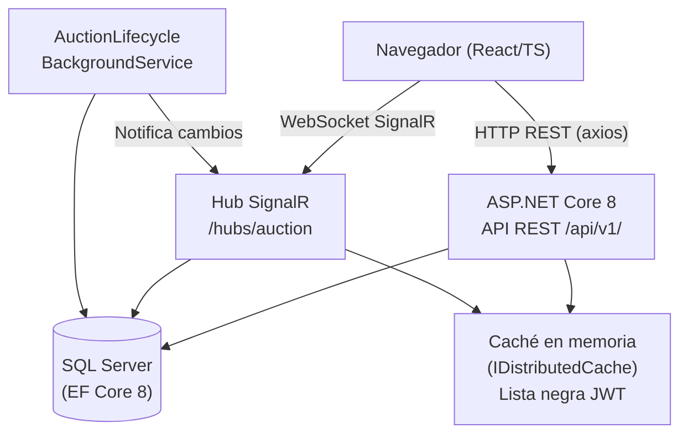
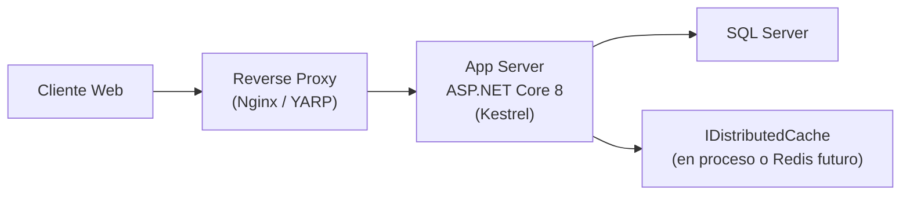
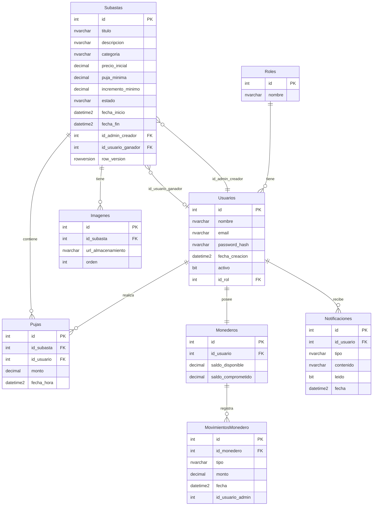
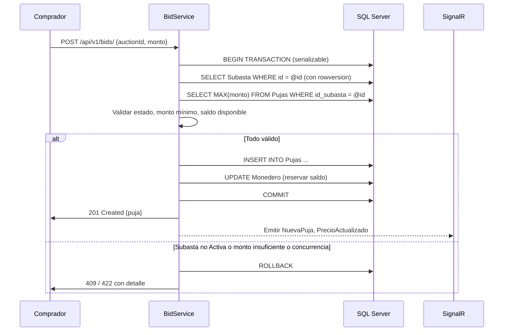

# Design Document — Plataforma de Subastas (MVP)

## Overview

La Plataforma de Subastas es una aplicación web que permite a compradores participar en subastas en tiempo real. El sistema se compone de un frontend React/TypeScript, una API REST ASP.NET Core 8 y comunicación en tiempo real mediante SignalR.

**Objetivos del diseño:**
- Garantizar consistencia transaccional en pujas concurrentes y operaciones de monedero.
- Automatizar el ciclo de vida de las subastas (Programada → Activa → Cerrada) sin intervención manual.
- Escalar horizontalmente la capa de API manteniendo la coherencia del hub SignalR.
- Exponer una API versionada que facilite la integración futura de clientes móviles.

**Decisiones de diseño principales:**
- Patrón de arquitectura por capas: `Controllers → Services → Repositories` para separar responsabilidades.
- Optimistic concurrency con `rowversion`/`xmin` en EF Core para pujas simultáneas.
- Background Service de .NET para transiciones automáticas de estado (tolerancia ≤ 60 s).
- Lista negra de tokens JWT en caché en memoria distribuida para invalidación inmediata al bloquear usuarios.
- Grupos SignalR por subasta (`AuctionGroup_{id}`) para distribución eficiente de eventos.


---

## Architecture

### Diagrama de alto nivel



### Diagrama de despliegue simplificado



### Capas de la aplicación

| Capa | Responsabilidad | Proyectos / Namespaces |
|---|---|---|
| **Presentación (Controllers)** | Validación HTTP, mapeo DTO↔dominio, autorización por rol | `AuctionPlatform.Api.Controllers` |
| **Servicios (Services)** | Lógica de negocio, orquestación, notificaciones SignalR | `AuctionPlatform.Application.Services` |
| **Repositorios (Repositories)** | Acceso a datos EF Core, consultas paginadas, transacciones | `AuctionPlatform.Infrastructure.Repositories` |
| **Dominio (Domain)** | Entidades, enumeraciones, excepciones de dominio | `AuctionPlatform.Domain` |
| **Infraestructura** | DbContext, configuraciones Fluent API, migraciones, caché | `AuctionPlatform.Infrastructure` |
| **Background Services** | Ciclo de vida automático de subastas | `AuctionPlatform.Workers` |


---

## Components and Interfaces

### Controllers

Todos los controladores extienden `ControllerBase` con el atributo `[ApiController]`. Las respuestas siguen siempre la envoltura:

```csharp
record ApiResponse<T>(T? Data, string? Error, object? Meta);
```

#### AuthController  `POST /api/v1/auth/`

| Endpoint | Método | Descripción | Auth |
|---|---|---|---|
| `/register` | POST | Registro de nuevo usuario | No |
| `/login` | POST | Login, retorna JWT | No |

#### UsersController  `GET|PUT /api/v1/users/`

| Endpoint | Método | Descripción | Auth |
|---|---|---|---|
| `/me` | GET | Perfil del usuario autenticado | JWT |
| `/me` | PUT | Actualizar nombre/contraseña | JWT |

#### AuctionsController  `GET|POST|PUT /api/v1/auctions/`

| Endpoint | Método | Descripción | Auth |
|---|---|---|---|
| `/` | GET | Catálogo paginado (estado=Activa) | JWT |
| `/{id}` | GET | Detalle con historial de pujas | JWT |
| `/` | POST | Crear subasta | Admin |
| `/{id}` | PUT | Editar subasta (solo Programada) | Admin |
| `/{id}/deactivate` | POST | Desactivar subasta Activa | Admin |

#### BidsController  `POST /api/v1/bids/`

| Endpoint | Método | Descripción | Auth |
|---|---|---|---|
| `/` | POST | Enviar puja | JWT (Comprador) |
| `/auction/{id}` | GET | Historial de pujas de subasta | Admin |

#### WalletController  `GET|POST /api/v1/wallet/`

| Endpoint | Método | Descripción | Auth |
|---|---|---|---|
| `/` | GET | Saldo e historial últimos 90 días | JWT |
| `/credit` | POST | Acreditar saldo | Admin |
| `/withdraw` | POST | Retirar saldo | Admin |

#### AdminController  `GET /api/v1/admin/`

| Endpoint | Método | Descripción | Auth |
|---|---|---|---|
| `/users` | GET | Listado paginado de usuarios | Admin |
| `/users/{id}/block` | POST | Bloquear usuario | Admin |
| `/users/{id}/unblock` | POST | Desbloquear usuario | Admin |
| `/users/{id}/wallet` | GET | Historial monedero de usuario | Admin |
| `/auctions` | GET | Listado paginado con estado y pujas | Admin |
| `/auctions/{id}/bids` | GET | Historial completo de pujas | Admin |

### Interfaces de Servicios

```csharp
// Autenticación y usuarios
interface IAuthService
{
    Task<AuthResult> RegisterAsync(RegisterDto dto);
    Task<AuthResult> LoginAsync(LoginDto dto);
    Task BlockUserAsync(int userId, int adminId);
    Task UnblockUserAsync(int userId);
    Task UpdateProfileAsync(int userId, UpdateProfileDto dto);
}

// Subastas
interface IAuctionService
{
    Task<PagedResult<AuctionSummaryDto>> GetCatalogAsync(CatalogFilterDto filter);
    Task<AuctionDetailDto> GetDetailAsync(int auctionId);
    Task<AuctionDto> CreateAsync(CreateAuctionDto dto, int adminId);
    Task<AuctionDto> UpdateAsync(int auctionId, UpdateAuctionDto dto, int adminId);
    Task DeactivateAsync(int auctionId, int adminId);
    Task TransitionStatesAsync(); // llamado por el BackgroundService
}

// Pujas
interface IBidService
{
    Task<BidDto> PlaceBidAsync(PlaceBidDto dto, int userId);
    Task<PagedResult<BidDto>> GetBidHistoryAsync(int auctionId, PaginationDto pagination);
}

// Monedero
interface IWalletService
{
    Task<WalletDto> GetWalletAsync(int userId);
    Task CreditAsync(int userId, decimal amount, int adminId);
    Task WithdrawAsync(int userId, decimal amount, int adminId);
    Task ReserveFundsAsync(int userId, decimal amount);
    Task ReleaseFundsAsync(int userId, decimal amount);
}
```

### Hub SignalR

```csharp
// Hub principal — /hubs/auction
class AuctionHub : Hub
{
    // Unirse al grupo de una subasta
    Task JoinAuctionGroup(int auctionId);
    // Salir del grupo
    Task LeaveAuctionGroup(int auctionId);
}

// Eventos emitidos a los clientes
record NuevaPujaEvent(int AuctionId, decimal NuevoMonto, string NombrePujador, DateTime FechaHora);
record TickContadorEvent(int AuctionId, TimeSpan TiempoRestante);
record PrecioActualizadoEvent(int AuctionId, decimal NuevoPrecio);
record EstadoSubastaEvent(int AuctionId, string NuevoEstado, string? Ganador);
```


---

## Data Models

### Diagrama entidad-relación



### Configuraciones EF Core (Fluent API) — puntos clave

```csharp
// Usuarios
builder.Property(u => u.Email).HasMaxLength(254).IsRequired();
builder.HasIndex(u => u.Email).IsUnique();
builder.Property(u => u.PasswordHash).HasMaxLength(72).IsRequired();
builder.Property(u => u.FechaCreacion).HasColumnType("datetime2").IsRequired();

// Subastas
builder.Property(s => s.PrecioInicial).HasColumnType("decimal(18,2)");
builder.Property(s => s.PujaMinima).HasColumnType("decimal(18,2)");
builder.Property(s => s.IncrementoMinimo).HasColumnType("decimal(18,2)");
builder.Property(s => s.FechaInicio).HasColumnType("datetime2");
builder.Property(s => s.FechaFin).HasColumnType("datetime2");
builder.Property(s => s.Estado).HasConversion<string>(); // enum → nvarchar
builder.Property(s => s.RowVersion).IsRowVersion(); // optimistic concurrency

// Monederos
builder.Property(m => m.SaldoDisponible).HasColumnType("decimal(18,2)");
builder.Property(m => m.SaldoComprometido).HasColumnType("decimal(18,2)");
builder.HasIndex(m => m.IdUsuario).IsUnique();

// MovimientosMonedero
builder.Property(mm => mm.Tipo).HasConversion<string>(); // enum → nvarchar
builder.Property(mm => mm.Monto).HasColumnType("decimal(18,2)");
builder.Property(mm => mm.Fecha).HasColumnType("datetime2");

// Pujas — índice compuesto para desempate eficiente
builder.HasIndex(p => new { p.IdSubasta, p.Monto, p.FechaHora });
```

### Enumeraciones del dominio

```csharp
enum EstadoSubasta { Programada, Activa, Cerrada, Inactiva }
enum TipoMovimiento { Acreditacion, Retiro, Reserva, Liberacion }
```

### DTOs principales

```csharp
// Registro
record RegisterDto(string Nombre, string Email, string Password);
// Login
record LoginDto(string Email, string Password);
// Resultado de auth
record AuthResult(string Token, DateTime ExpiresAt, string Rol);
// Puja
record PlaceBidDto(int AuctionId, decimal Monto);
// Operación de monedero
record WalletOperationDto(int UserId, decimal Monto);
// Paginación genérica
record PaginationDto(int Page = 1, int PageSize = 20);
record PagedResult<T>(IEnumerable<T> Items, int TotalCount, int Page, int PageSize);
```


---

## Correctness Properties

*Una propiedad es una característica o comportamiento que debe cumplirse en todas las ejecuciones válidas del sistema — es decir, una afirmación formal sobre lo que el sistema debe hacer. Las propiedades sirven de puente entre las especificaciones en lenguaje natural y las garantías de corrección verificables automáticamente.*

### Reflexión sobre redundancia

Antes de definir las propiedades finales, se identificaron las siguientes consolidaciones:

- Las propiedades de validación de registro (1.1) y rol por defecto (1.2) se consolidan: ambas aplican a cualquier input de registro.
- Las propiedades de primera puja (4.2) y puja posterior (4.3) son distintas y se mantienen separadas.
- Las propiedades de operación de monedero (5.2 acreditación + 5.4 retiro) se consolidan en una sola propiedad de invariante de saldo.
- Las propiedades de saldo comprometido al pujar (5.6) y liberación al ser superado (5.7) son complementarias y se consolidan.
- La ordenación de historial de pujas para Comprador (3.3) y Administrador (6.4) se consolidan en una sola propiedad.
- El control de acceso HTTP 403 para rutas admin (6.7) cubre también la autorización del hub SignalR (7.6), se mantienen separadas por mecanismo.

---

### Property 1: Validación de registro rechaza exactamente los inputs inválidos

*Para cualquier* combinación de nombre, correo y contraseña enviada al endpoint de registro, la plataforma debe aceptar la solicitud si y sólo si: el nombre tiene entre 2 y 100 caracteres, el correo cumple el formato RFC 5321 y la contraseña tiene entre 8 y 128 caracteres con al menos una mayúscula, una minúscula y un dígito. Cualquier input que no cumpla todas las condiciones debe rechazarse con HTTP 422.

**Validates: Requirements 1.1**

---

### Property 2: Todo usuario registrado recibe rol Comprador y monedero en cero

*Para cualquier* usuario creado exitosamente mediante el endpoint de registro, su rol debe ser `Comprador` y debe existir un `Monedero` asociado con `saldo_disponible = 0,00` y `saldo_comprometido = 0,00`.

**Validates: Requirements 1.2, 5.1**

---

### Property 3: JWT de login contiene los claims correctos y expira en 24 horas

*Para cualquier* usuario registrado y activo, al autenticarse con credenciales correctas, el token JWT retornado debe contener el `id` del usuario, su `rol`, y debe tener una expiración exactamente de 24 horas a partir del momento de emisión.

**Validates: Requirements 1.5**

---

### Property 4: Tokens de usuarios bloqueados son rechazados en todos los endpoints protegidos

*Para cualquier* usuario con token JWT válido en circulación, en el momento en que un Administrador bloquea a ese usuario, cualquier solicitud subsiguiente a un endpoint protegido usando ese token debe retornar HTTP 403 sin importar el tiempo de expiración del token.

**Validates: Requirements 1.8, 6.2**

---

### Property 5: Actualización de perfil sólo permite nombre y contraseña, nunca el correo

*Para cualquier* usuario autenticado que envíe una solicitud de actualización de perfil, los campos `nombre` y `contraseña` pueden modificarse, mientras que el campo `correo` debe permanecer inalterado aunque se incluya en el cuerpo de la solicitud.

**Validates: Requirements 1.7**

---

### Property 6: Tokens inválidos, expirados o ausentes producen HTTP 401

*Para cualquier* endpoint protegido de la API, una solicitud que incluya un token JWT expirado, con firma inválida o sin token debe retornar HTTP 401, independientemente del contenido del cuerpo o los parámetros de la solicitud.

**Validates: Requirements 1.10**

---

### Property 7: Subastas nuevas con fecha_inicio futura inician en estado Programada

*Para cualquier* subasta creada con `fecha_inicio` en el futuro, el estado inicial almacenado en la base de datos debe ser `Programada`.

**Validates: Requirements 2.4**

---

### Property 8: Validación de fechas de subasta rechaza duraciones inválidas

*Para cualquier* par de valores (`fecha_inicio`, `fecha_fin`) enviados al crear o editar una subasta, la plataforma debe rechazar con HTTP 422 si `fecha_fin ≤ fecha_inicio` o si la diferencia entre ambas es inferior a 1 hora.

**Validates: Requirements 2.2**

---

### Property 9: Sólo subastas en estado Programada pueden editarse

*Para cualquier* solicitud de edición de una subasta, la operación debe tener éxito sólo si el estado actual de la subasta es `Programada`. Subastas en estado `Activa`, `Cerrada` o `Inactiva` deben rechazar cualquier edición con HTTP 422.

**Validates: Requirements 2.5**

---

### Property 10: El catálogo sólo contiene subastas en estado Activa

*Para cualquier* llamada al endpoint del catálogo, todos los elementos retornados deben corresponder a subastas cuyo estado es `Activa`. Ninguna subasta en estado `Programada`, `Cerrada` o `Inactiva` debe aparecer en los resultados.

**Validates: Requirements 3.1**

---

### Property 11: El filtro por categoría produce resultados de esa categoría únicamente

*Para cualquier* valor de filtro de categoría aplicado al catálogo, todos los elementos retornados deben pertenecer exactamente a esa categoría y la página debe contener como máximo 20 elementos.

**Validates: Requirements 3.2**

---

### Property 12: El historial de pujas de una subasta está ordenado por monto descendente

*Para cualquier* subasta con al menos una puja, el historial de pujas retornado en el detalle (tanto para Comprador como para Administrador) debe estar ordenado de mayor a menor monto. En caso de montos iguales, la de menor `fecha_hora` UTC debe aparecer primero.

**Validates: Requirements 3.3, 6.4**

---

### Property 13: El ganador al cerrar una subasta es el pujador de mayor monto (desempate por fecha)

*Para cualquier* lista de pujas registradas en una subasta al momento de su cierre, el `id_usuario_ganador` persistido debe corresponder al usuario que realizó la puja de mayor monto. En caso de empate de monto, debe corresponder al usuario con la puja de menor `fecha_hora` UTC.

**Validates: Requirements 3.5, 3.6, 4.9**

---

### Property 14: Primera puja requiere monto ≥ puja_mínima

*Para cualquier* subasta sin pujas previas, una nueva puja debe ser aceptada si y sólo si su monto es mayor o igual a la `puja_mínima` configurada en la subasta. Montos menores deben rechazarse con HTTP 422 indicando el monto mínimo requerido.

**Validates: Requirements 4.2**

---

### Property 15: Pujas posteriores requieren superar la mayor en al menos el incremento_mínimo

*Para cualquier* subasta con al menos una puja previa, una nueva puja debe ser aceptada si y sólo si su monto supera la puja más alta actual en al menos el valor de `incremento_mínimo`. Montos que no cumplan esto deben rechazarse con HTTP 422.

**Validates: Requirements 4.3**

---

### Property 16: Puja rechazada si saldo_disponible es insuficiente

*Para cualquier* combinación de saldo disponible del pujador y monto de puja, la plataforma debe aceptar la puja si y sólo si `saldo_disponible ≥ monto`. Cuando el saldo es insuficiente debe retornar HTTP 422.

**Validates: Requirements 4.5**

---

### Property 17: Los saldos del monedero se actualizan correctamente en acreditación, retiro y reserva

*Para cualquier* secuencia de operaciones sobre un monedero (acreditación, retiro válido, reserva por puja, liberación por superación), los valores de `saldo_disponible` y `saldo_comprometido` deben satisfacer en todo momento el invariante: `saldo_disponible ≥ 0`, `saldo_comprometido ≥ 0` y `saldo_disponible + saldo_comprometido = saldo_total_acreditado - saldo_total_retirado`.

**Validates: Requirements 5.2, 5.3, 5.4, 5.6, 5.7**

---

### Property 18: Todo MovimientoMonedero contiene todos los campos requeridos

*Para cualquier* movimiento de monedero creado por cualquier operación (acreditación, retiro, reserva, liberación), el registro en `MovimientosMonedero` debe contener: `fecha` en UTC, `tipo` válido, `monto > 0`, `id_monedero` válido y (cuando aplique) `id_usuario_admin`.

**Validates: Requirements 5.5**

---

### Property 19: Las rutas de administración retornan HTTP 403 para usuarios con rol Comprador

*Para cualquier* endpoint bajo `/api/v1/admin/`, una solicitud autenticada con token JWT de un usuario con rol `Comprador` debe retornar HTTP 403, independientemente del contenido del cuerpo o los parámetros.

**Validates: Requirements 6.7**

---

### Property 20: El hub SignalR emite PrecioActualizado y NuevaPuja ante cualquier puja aceptada

*Para cualquier* puja aceptada que incremente el precio máximo de una subasta, el hub debe emitir el evento `PrecioActualizado` a todos los clientes del grupo `AuctionGroup_{id}` con el nuevo precio, y el evento `NuevaPuja` con el monto, nombre del pujador y fecha_hora.

**Validates: Requirements 7.1, 7.3**

---

### Property 21: El hub SignalR emite EstadoSubasta ante cualquier cambio de estado

*Para cualquier* transición de estado de una subasta (Programada→Activa, Activa→Cerrada, Activa→Inactiva), el hub debe emitir el evento `EstadoSubasta` a todos los clientes conectados al grupo con el nuevo estado y, cuando aplique, el nombre del ganador.

**Validates: Requirements 7.4**

---

### Property 22: Toda respuesta de la API sigue la estructura { data, error, meta }

*Para cualquier* endpoint de la API, independientemente del resultado (éxito o error), la respuesta JSON debe contener exactamente los campos `data`, `error` y `meta` en el nivel raíz. `data` contiene el payload o `null`; `error` contiene el mensaje de error o `null`; `meta` contiene información de paginación u otros metadatos o `null`.

**Validates: Requirements 8.3**

---

### Property 23: Todas las fechas en respuestas de la API están en formato ISO 8601 UTC

*Para cualquier* campo de tipo fecha/hora en cualquier respuesta de la API, el valor debe estar serializado en formato ISO 8601 UTC (ejemplo: `"2024-05-15T10:30:00Z"`). No deben aparecer fechas en otros formatos ni con offset distinto de `Z`/`+00:00`.

**Validates: Requirements 8.6**


---

## Error Handling

### Middleware global de excepciones

Se implementa un `ExceptionHandlingMiddleware` que intercepta todas las excepciones no controladas y las mapea a respuestas estructuradas. El middleware se registra al inicio del pipeline, antes del middleware de autenticación.

```csharp
// Mapeo de excepciones a códigos HTTP
class ExceptionHandlingMiddleware
{
    // DomainException (base)     → 422 Unprocessable Entity
    // NotFoundException          → 404 Not Found
    // ConflictException          → 409 Conflict
    // ForbiddenException         → 403 Forbidden
    // UnauthorizedException      → 401 Unauthorized
    // ValidationException        → 422 + lista de campos con error
    // DbUpdateConcurrencyException → 409 (puja simultánea rechazada)
    // Exception (no controlada)  → 500 + log interno, sin stack trace al cliente
}
```

### Convenciones de códigos HTTP

| Escenario | Código HTTP |
|---|---|
| Operación exitosa | 200 OK |
| Recurso creado | 201 Created |
| Validación de campos fallida | 422 Unprocessable Entity |
| Recurso no encontrado | 404 Not Found |
| Conflicto de concurrencia (puja simultánea) | 409 Conflict |
| Sin autenticación / token inválido | 401 Unauthorized |
| Sin autorización (rol insuficiente) | 403 Forbidden |
| Límite de tasa superado | 429 Too Many Requests |
| Error interno del servidor | 500 Internal Server Error |

### Control de concurrencia en pujas

Las pujas utilizan transacciones serializables con `rowversion` en la entidad `Subastas` para garantizar la escritura atómica. El flujo es:



### Invalidación de tokens JWT

La lista negra se mantiene en `IDistributedCache` (memoria en desarrollo, Redis en producción). Al bloquear un usuario:

1. Se establece `activo = false` en `Usuarios`.
2. Se agrega la entrada `"blacklist:{userId}"` en caché con TTL de 24 h.
3. El middleware JWT valida en cada request si el usuario está en la lista negra antes de conceder acceso.

```csharp
// En el middleware de validación de claims
if (await _cache.GetStringAsync($"blacklist:{userId}") != null)
    return Forbid();
```


### Background Service: ciclo de vida automático

`AuctionLifecycleBackgroundService` hereda de `BackgroundService` y se ejecuta cada 30 segundos (dentro de la tolerancia de 60 s).

```csharp
// Pseudocódigo del loop principal
while (!cancellationToken.IsCancellationRequested)
{
    var now = DateTime.UtcNow;

    // Programada → Activa
    var toActivate = await repo.GetAuctionsByStateAndDateAsync(
        EstadoSubasta.Programada, maxFechaInicio: now);
    foreach (var auction in toActivate)
    {
        auction.Estado = EstadoSubasta.Activa;
        await repo.SaveAsync();
        await hub.Clients.Group($"AuctionGroup_{auction.Id}")
            .SendAsync("EstadoSubasta", new { Estado = "Activa" });
    }

    // Activa → Cerrada
    var toClose = await repo.GetAuctionsByStateAndDateAsync(
        EstadoSubasta.Activa, maxFechaFin: now);
    foreach (var auction in toClose)
    {
        var winnerBid = await repo.GetWinningBidAsync(auction.Id); // MAX monto, MIN fecha
        auction.Estado = EstadoSubasta.Cerrada;
        auction.IdUsuarioGanador = winnerBid?.IdUsuario;
        await repo.SaveAsync();
        // Liberar saldo comprometido de pujadores no ganadores
        await walletService.ReleaseAllExceptWinnerAsync(auction.Id, winnerBid?.IdUsuario);
        await hub.Clients.Group($"AuctionGroup_{auction.Id}")
            .SendAsync("EstadoSubasta", new { Estado = "Cerrada", Ganador = winnerBid?.NombreUsuario });
    }

    await Task.Delay(TimeSpan.FromSeconds(30), cancellationToken);
}
```

### Frontend: manejo de errores

- Todos los errores de API se centralizan en un interceptor `axios` que lee el campo `error` de la respuesta.
- HTTP 401 redirige automáticamente al login y limpia el token local.
- HTTP 403 muestra un componente `AccessDenied`.
- HTTP 422 mapea los errores de campo al formulario correspondiente.
- Errores de conexión SignalR se reintentan automáticamente con backoff exponencial (comportamiento nativo del cliente `@microsoft/signalr`).


---

## Testing Strategy

### Enfoque general

Se sigue un enfoque de **doble cobertura**:

1. **Tests unitarios y de ejemplo** — verifican comportamientos concretos, casos borde e integración entre capas.
2. **Tests basados en propiedades (PBT)** — verifican propiedades universales a través de cientos de inputs generados aleatoriamente.

Ambos enfoques son complementarios: los tests de ejemplo capturan escenarios concretos conocidos; los tests de propiedades descubren regresiones en el espacio de inputs no anticipado.

### Herramientas de testing

| Capa | Framework | Librería PBT |
|---|---|---|
| Backend (.NET) | xUnit | FsCheck (integración xUnit) |
| Frontend (React/TS) | Vitest + React Testing Library | fast-check |
| Integración | xUnit + TestContainers (SQL Server) | — |

### Tests basados en propiedades (backend)

Cada test de propiedad debe ejecutarse con **mínimo 100 iteraciones** y estar etiquetado con un comentario que referencie la propiedad del documento de diseño.

```csharp
// Etiqueta de referencia en cada test de propiedad:
// Feature: auction-platform, Property N: <texto de la propiedad>
```

**Propiedades a implementar como tests PBT:**

| Propiedad | Componente a testear | Generadores necesarios |
|---|---|---|
| P1: Validación de registro | `UserValidator` (clase pura) | `Arb<string>` para nombre, email, contraseña |
| P2: Rol Comprador + Monedero | `IAuthService.RegisterAsync` (mock de repo) | Inputs de registro válidos |
| P3: Claims y expiración JWT | `JwtTokenService.GenerateToken` | Usuarios con distintos ids y roles |
| P4: Tokens bloqueados rechazados | `TokenBlacklistMiddleware` | Tokens generados + usuarios bloqueados |
| P5: Actualización de perfil | `UserService.UpdateProfileAsync` | Nombres, contraseñas aleatorias |
| P6: HTTP 401 para tokens inválidos | `AuthorizationMiddleware` | Tokens malformados, expirados |
| P7: Estado inicial Programada | `AuctionService.CreateAsync` | Fechas futuras aleatorias |
| P8: Validación de fechas | `AuctionValidator` | Pares de fechas (inicio, fin) |
| P9: Edición sólo Programada | `AuctionService.UpdateAsync` | Subastas en los 4 estados |
| P10: Catálogo sólo Activas | `AuctionService.GetCatalogAsync` | Conjuntos de subastas en distintos estados |
| P11: Filtro categoría | `AuctionService.GetCatalogAsync` | Categorías y subastas aleatorias |
| P12: Historial ordenado por monto | `BidService.GetBidHistoryAsync` | Listas de pujas con montos aleatorios |
| P13: Ganador correcto al cerrar | `AuctionService.DetermineWinner` | Listas de pujas con montos y fechas aleatorias |
| P14: Primera puja ≥ puja_mínima | `BidService.PlaceBidAsync` | Montos y puja_mínima aleatorios |
| P15: Puja posterior supera incremento | `BidService.PlaceBidAsync` | Subastas con pujas previas, montos aleatorios |
| P16: Saldo insuficiente rechazado | `WalletService` + `BidService` | Combinaciones de saldo/monto |
| P17: Invariante de saldos | `WalletService` | Secuencias de operaciones aleatorias |
| P18: Campos de MovimientoMonedero | `WalletService` | Operaciones de cualquier tipo |
| P19: HTTP 403 rutas admin | `AdminController` (filtros) | Tokens con rol Comprador |
| P20: Eventos SignalR en nueva puja | `AuctionHub` + `BidService` (mock hub) | Pujas aceptadas válidas |
| P21: EstadoSubasta en cambio de estado | `AuctionHub` + `BgService` (mock hub) | Transiciones de estado |
| P22: Estructura { data, error, meta } | Middleware de respuesta | Cualquier endpoint |
| P23: Fechas ISO 8601 UTC | Serialización JSON | Respuestas con campos de fecha |

### Tests unitarios y de ejemplo

Focalizados en los casos que el PBT no cubre bien:

- Flujo completo de login con credenciales incorrectas (HTTP 401).
- Desactivación de subasta activa (cambio a Inactiva + cancelación de pujas).
- Consulta de monedero con historial de 90 días.
- Listado paginado de usuarios para el panel de administración.
- Registro duplicado de email (HTTP 409).
- Puja en subasta no activa (HTTP 422).

### Tests de integración

Usan TestContainers para levantar SQL Server en Docker durante el test:

- Transición automática Programada → Activa (BackgroundService real).
- Transición automática Activa → Cerrada con determinación del ganador.
- Tolerancia ≤ 60 s verificada con timestamps reales.
- Latencia de evento `NuevaPuja` ≤ 3 s desde la escritura en BD.
- Emisión consistente de eventos SignalR a múltiples clientes conectados.
- Rate limiting: HTTP 429 tras 100 requests/min por token.

### Tests de humo (smoke)

Ejecutados en el entorno de staging antes de cualquier despliegue:

- Hash bcrypt con cost ≥ 12 verificado para contraseñas almacenadas.
- Endpoint `/api/docs` retorna esquema OpenAPI 3.0 válido.
- Todos los endpoints base bajo `/api/v1/` responden (no 404/500 en frío).
- La coexistencia de rutas `/api/v1/` y `/api/v2/` no produce conflictos.

### Tests de propiedad en el frontend (fast-check)

```typescript
// Etiqueta de referencia:
// Feature: auction-platform, Property N: <texto>

// Ejemplo P22 en frontend
fc.assert(fc.property(
  fc.record({ data: fc.anything(), error: fc.option(fc.string()), meta: fc.option(fc.anything()) }),
  (response) => {
    expect(response).toHaveProperty('data');
    expect(response).toHaveProperty('error');
    expect(response).toHaveProperty('meta');
  }
), { numRuns: 100 });
```

**Propiedades PBT frontend destacadas:**

| Propiedad | Hook / Servicio | Descripción |
|---|---|---|
| P1: Validación de formulario de registro | `useRegisterForm` | Inputs generados aleatoriamente → estados de error correctos |
| P12: Orden historial de pujas en UI | `useBidHistory` | Listas de pujas → siempre ordenadas descendente por monto |
| P22: Estructura de respuesta API | Interceptor axios | Todas las respuestas tienen `{ data, error, meta }` |
| P23: Formato de fecha en UI | Utilitarios de formateo | Fechas ISO 8601 → siempre se parsean y muestran correctamente |

